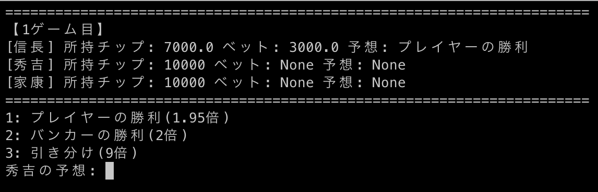

# terminal-games
## 概要
Pythonで作成された
ターミナル上で行うゲーム．
**プルリクエスト等大歓迎 !**
## インストール
```
pip3 install git+https://github.com/kdg2024/terminal-games.git
```
インストールした直後は実行ファイルのパスが通っていないため，
新しいターミナルを開くか，
```
exec zsh
```
を実行する．それでも`command not found`等が後に出た場合は`zshrc`
に追記が必要かもしれない．23年度の基礎クラスのプログラミングの授業で
`django-admin`を最初実行できなかったのと同じ原理なので，
```
echo "export PATH=\$PATH:\""$(pip3 show django | grep Location | cut -d " " -f 2 | sed -E 's|/lib/python[^/]*/site-packages|/bin|')\" >> ~/.zshrc; cat ~/.zshrc;
```
を一度実行したあと
```
exec zsh
```
でおそらく使用可能になる．
## 更新
```
pip3 install git+https://github.com/kdg2024/terminal-games.git -U
```
- リポジトリが更新されていても[setup.py](setup.py)に記述されたversionが変わっていなければ更新されないので注意

## アンインストール
```
pip3 uninstall terminal-games
```
## 遊び方
### バカラ

`argparse`を用いているためオプションを指定することができる．  
ヘルプを確認
```
baccarat.py -h
```
一人でプレイ
```
baccarat.py
```
複数人でプレイ（一例）
```
baccarat.py -p "信長" "秀吉" "家康"
```


